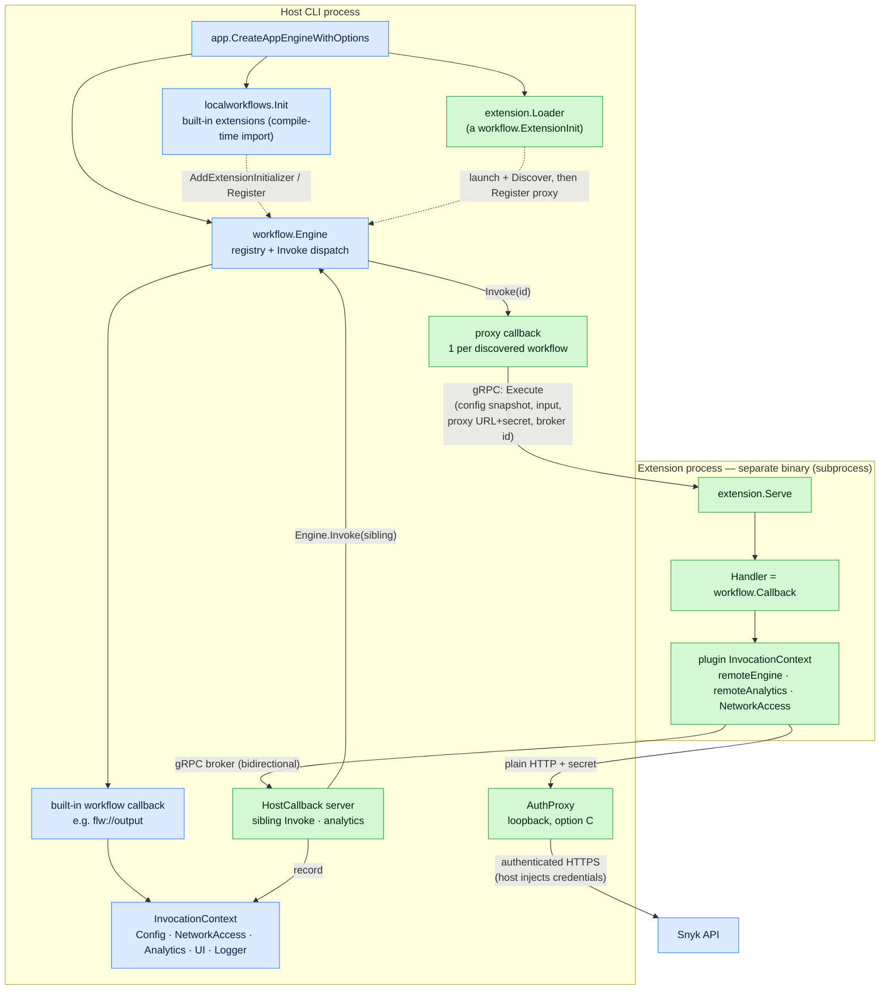
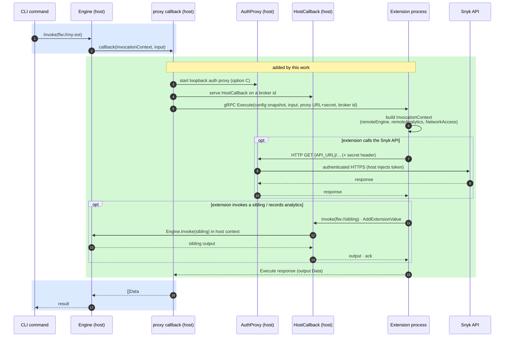

# Dynamic Extensions — Architecture Diagrams

These diagrams accompany [dynamic-extensions-design.md](./dynamic-extensions-design.md).

**Legend:** 🟦 blue = pre-existing architecture · 🟩 green = added by the dynamic-extensions work.

## Component view — before vs. after

Everything blue already existed: extensions were Go functions linked into the
binary at compile time and registered with the engine. Everything green is new —
it lets an extension instead be a **separate binary**, loaded at runtime and run
in its own process, while still looking like an ordinary workflow.

Key idea: the green path is a faithful reflection of the blue one across a
process boundary. A built-in workflow is reached by `Engine.Invoke(id)` → its
callback gets an `InvocationContext`. A dynamic extension is reached by
`Engine.Invoke(id)` → a **proxy** callback → gRPC `Execute` → the extension's
handler gets a **reconstructed** `InvocationContext` whose network/engine/
analytics call back into the host.

## Sequence — one extension invocation

Blue band = the pre-existing dispatch shape; green band = the new
cross-process interactions (network via the auth proxy, sibling invoke and
analytics via the broker).

## What did NOT change

- The `workflow.Engine`, `Register`/`Invoke`, `InvocationContext`, and
  content-typed `Data` contracts are untouched — extensions plug into the exact
  same seams as built-ins.
- Built-in (compile-time) extensions still work exactly as before; the loader is
  added only when extension paths are configured.
- The only core addition is `workflow.ResolveInvokeOptions`, a helper that lets
  an `Invoke` be forwarded across the process boundary.
